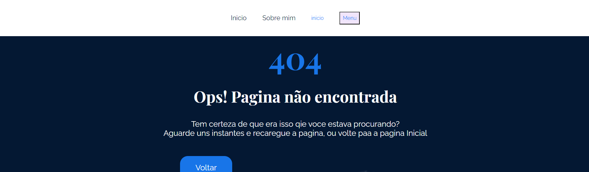

# Foto do Projeto
    INICIO
 

    POST/sobremim
 

    ERRO
 
# Rotas aninhamento - dinamico

    widow.lacation  window.location.pathname === "/" ? <ProjetoIncial /> : <SobreMim/>
     
# Colocando uma biblioteca de rotas  
    intalar / npm install react-router-dom@6 /

importa BrowserRouter - router 

<h3>Mudamos o nome do APP pra AppRoutes from ./routes AppRoutes;</h3>

funcionamento depende de routes

Algumas funcionalidades nao precisa ta dentro de Routes

Outlet

BrowserRoute

Routes

Route 

rotasfixa - rotas pai - rotas  filhas

Route path='/'

-Route index 

-Route 'sobremim'

-Route path = '/post/:id'

    Route path="*" element - url nao exite
    NavLink -> isActive
    Link-
    useParams
    useLocation
    useNavigate

Svg Ai a gente trabalhar com svg a gente trata como componente

import {ReactComponent as NomeComponete} from '/url/nome'

     A sintaxe import { ReactComponent as NomeDoComponente } from 'caminho_do_componente';

/* SOBRE ESCREVE UM BOTAO PRA DIFERENTES LUGARS*/

.botaoLer.lg

class -> condicional passando por props o nome da class adicional 

     <button className={`${style.botaoLer} ${style[props.tamanho]}`} 

se vem tamnho = {""} ou tamanho = {"lg"}

        const navega = useNavigate();
onClick={()=>navega("/")} 
 ou

onClick={()=>navega(-1)} - volta uma pagina anterior 

Route 

usao do scrollToTop para logica de route necessario
# metodos 

slice() - pegar qualtidade no array

    O método slice() retorna uma cópia de parte de um array a partir de um subarray criado entre as posições início e fim (fim não é incluído) de um array original. O Array original não é modificado.

sort() - ordenar (a-b)=>a.id-b-id

    O método sort() ordena os elementos do próprio array e retorna o array.

filter() - filtrar array

    O método filter() cria um novo array com todos os elementos que passaram no teste implementado pela função fornecida.
    map() - transformar array

useEffect quando tem uma mudança em uma constante

# dependeciass adicionadas

        "react-markdown": "^8.0.7",
        "react-router-dom": "^6.14.1",

# ReactMarkdown
 npm intall react-markdown

 import ReactMarkdown from 'react-markdown'

# Getting Started with Create React App

This project was bootstrapped with [Create React App](https://github.com/facebook/create-react-app).

## Available Scripts

In the project directory, you can run:

### `npm start`

Runs the app in the development mode.\
Open [http://localhost:3000](http://localhost:3000) to view it in your browser.

The page will reload when you make changes.\
You may also see any lint errors in the console.

### `npm test`

Launches the test runner in the interactive watch mode.\
See the section about [running tests](https://facebook.github.io/create-react-app/docs/running-tests) for more information.

### `npm run build`

Builds the app for production to the `build` folder.\
It correctly bundles React in production mode and optimizes the build for the best performance.

The build is minified and the filenames include the hashes.\
Your app is ready to be deployed!

See the section about [deployment](https://facebook.github.io/create-react-app/docs/deployment) for more information.

### `npm run eject`

**Note: this is a one-way operation. Once you `eject`, you can't go back!**

If you aren't satisfied with the build tool and configuration choices, you can `eject` at any time. This command will remove the single build dependency from your project.

Instead, it will copy all the configuration files and the transitive dependencies (webpack, Babel, ESLint, etc) right into your project so you have full control over them. All of the commands except `eject` will still work, but they will point to the copied scripts so you can tweak them. At this point you're on your own.

You don't have to ever use `eject`. The curated feature set is suitable for small and middle deployments, and you shouldn't feel obligated to use this feature. However we understand that this tool wouldn't be useful if you couldn't customize it when you are ready for it.

## Learn More

You can learn more in the [Create React App documentation](https://facebook.github.io/create-react-app/docs/getting-started).

To learn React, check out the [React documentation](https://reactjs.org/).

### Code Splitting

This section has moved here: [https://facebook.github.io/create-react-app/docs/code-splitting](https://facebook.github.io/create-react-app/docs/code-splitting)

### Analyzing the Bundle Size

This section has moved here: [https://facebook.github.io/create-react-app/docs/analyzing-the-bundle-size](https://facebook.github.io/create-react-app/docs/analyzing-the-bundle-size)

### Making a Progressive Web App

This section has moved here: [https://facebook.github.io/create-react-app/docs/making-a-progressive-web-app](https://facebook.github.io/create-react-app/docs/making-a-progressive-web-app)

### Advanced Configuration

This section has moved here: [https://facebook.github.io/create-react-app/docs/advanced-configuration](https://facebook.github.io/create-react-app/docs/advanced-configuration)

### Deployment

This section has moved here: [https://facebook.github.io/create-react-app/docs/deployment](https://facebook.github.io/create-react-app/docs/deployment)

### `npm run build` fails to minify

This section has moved here: [https://facebook.github.io/create-react-app/docs/troubleshooting#npm-run-build-fails-to-minify](https://facebook.github.io/create-react-app/docs/troubleshooting#npm-run-build-fails-to-minify)
